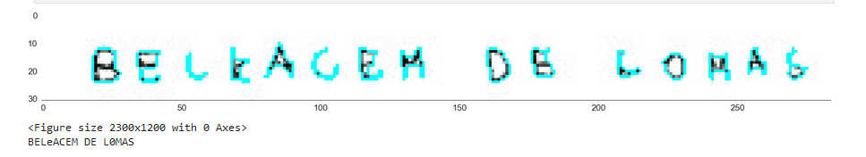
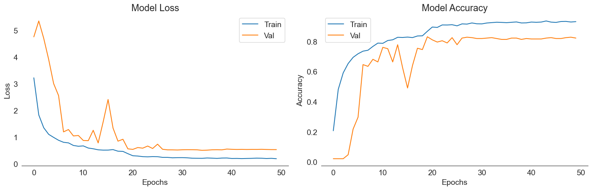
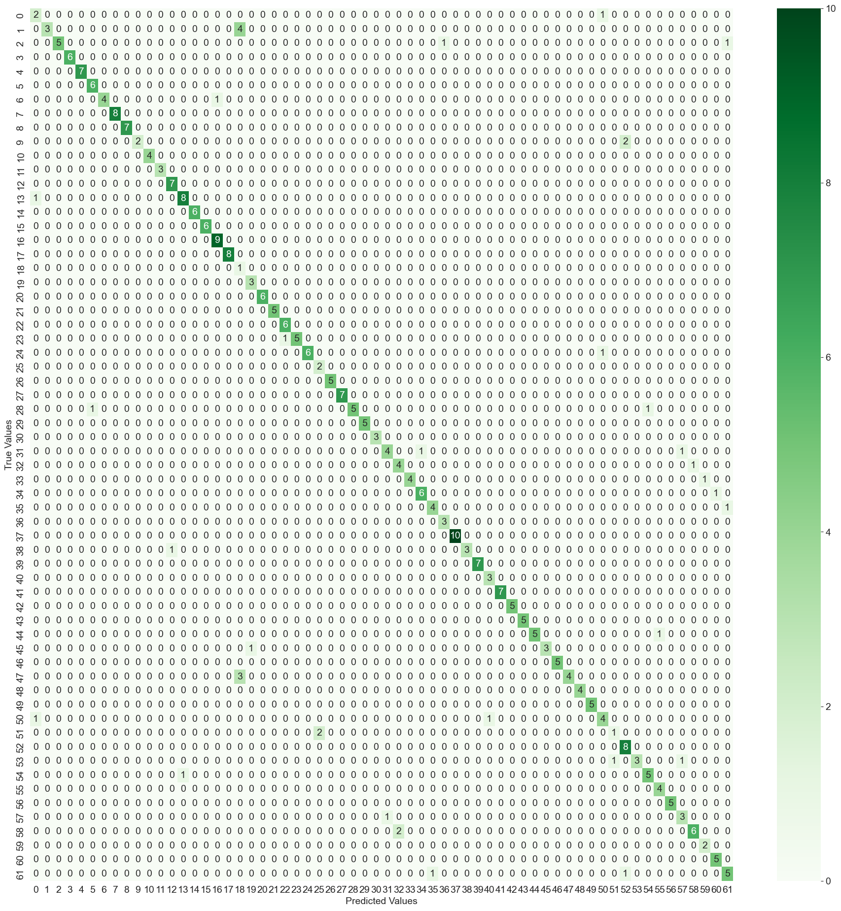

# OCR Model for Handwritten Text Recognition
OCR model that reads text from given image.


# Table Of Content
- [Introduction](#introduction)
- [Languages and Tools](#languages-and-tools)
- [Installation](#installation)
   - [Using Conda](#using-conda)
   - [Using Venv](#using-venv)
- [Usage](#usage)
- [Model Performance](#model-performance)
- [Uninstallation / Removal](#uninstallation--removal)
- [Credits](#credits)

# Introduction
This OCR model is a deep learning-based solution for recognizing handwritten text. The model uses convolutional neural networks (CNNs) to learn features from input images and a fully connected layer to classify the recognized text.
NOT: Original dataset of the project is the property of Toyota I am not allowed to share dataset as it is the property of Toyota and sharing this confidential dataset is strictly prohibited. Therefore, you will get error after downloading this project & running it directly since dataset is missing. However, this project might give you idea for similar projects as it is used by the biggest automative company in the world.

# Languages and Tools
<p align="left">
<a href="https://www.python.org" target="_blank" rel="noreferrer"></a>
<a href="https://www.tensorflow.org" target="_blank" rel="noreferrer"> </a>
<!-- <a href="https://pytorch.org/" target="_blank" rel="noreferrer"></a> -->
<a href="https://opencv.org/" target="_blank" rel="noreferrer"></a>
<a href="https://pandas.pydata.org/" target="_blank" rel="noreferrer"></a>
<a href="https://scikit-learn.org/" target="_blank" rel="noreferrer"> </a>
<a href="https://seaborn.pydata.org/" target="_blank" rel="noreferrer"> </a>
<a href="https://git-scm.com/" target="_blank" rel="noreferrer">  </a>
</p>

# Installation
I will mention two methods for installation that will not affect your original environment in your PC so after you are done using my project, you can completely delete remove it from your PC like you have never installed it before.

<details open><summary><h2>Using Conda</h2></summary>

* Create a new Conda environment for this project:
```
conda create -n bahadir python =3.9
```
* Activate the newly created Conda environment:
```
conda activate bahadir
```
* Clone the repository to your local machine:
```
git clone https
```
* Navigate to the cloned repository on your local machine:
```
cd repo
```
* Install the project dependencies using Conda:
```
conda install --file requirements.txt
```
* Start Jupyter Notebook:
```
jupyter notebook
```
* Select the ipnby file from the list.
* Run cells one by one WITH YOUR OWN DATASET.

</details>

<details open><summary><h2>Using Venv</h2></summary>

* Create a project folder in your driver
```
mkdir baha
```
* Navigate to the cloned repository on your local machine:
```
cd baha
```
* Create a new virtual environment using venv:
```
python -m venv bahadir
```
* Activate the newly created virtual environment:
```
.\bahadir\Scripts\activate
```
* Install the project dependencies using pip:
```
pip install -r requirements.txt
```
* Start Jupyter Notebook:
```
jupyter notebook
```
* Select the ipnby file from the list.
* Run cells one by one WITH YOUR OWN DATASET.

</details>

# Usage
This repository is in the form of an `ipynb` notebook and is not intended for use as a standalone program. The code contained in the notebook serves as a reference for how to train a Faster R-CNN model for correct wheel nut installation detection.

# Model Performance



# Uninstallation / Removal
If you have followed one of the installation steps above, you can completely remove this project from your computer without leaving any trace.

<details open><summary><h2>Using conda</h2></summary>

If you have installed the project using conda; remove the environment:
```
conda remove -n bahadir --all
```

</details>

<details open><summary><h2>Using venv</h2></summary>

If you have installed the project using venv, just delete the project folder where you have installed venv (in our case, it was the folder named "baha")

</details>

# Credits
Bahadir Ungor - Artificial Intelligence | Computer Vision | Data Science Engineer @ Toyota
<p align="left">
<a href="https://linkedin.com/in/bahaungor" target="blank"></a>
<a href="https://github.com/bahaungor" target="_blank"></a>
</p>
